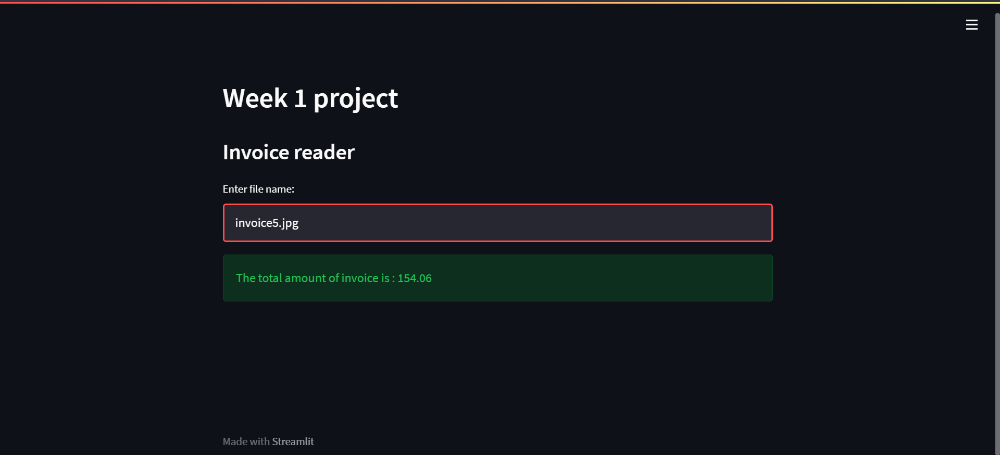
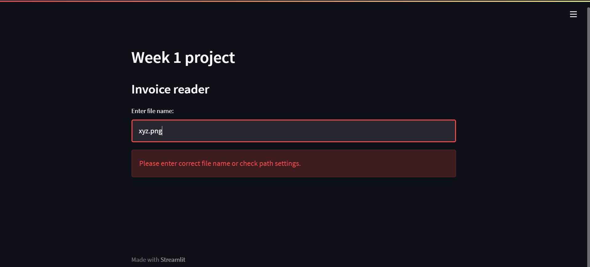

<h1 align="center">Invoice reader project</h1>

   &nbsp; &nbsp;
   &nbsp; &nbsp;
   &nbsp; &nbsp;

The aim of this project was to find out the total amount from image file of any invoice. To solve this [Tesseract OCR](https://opensource.google/projects/tesseract) has been used to convert the image of the invoice into string fromat and then the total amount is extracted using regex. This is implemented using [streamlit](https://streamlit.io/) and [FastAPI](https://fastapi.tiangolo.com/).

## Screenshots:

  

## Tools and Technologies used

   &nbsp; &nbsp; 
   &nbsp; &nbsp; 
  

